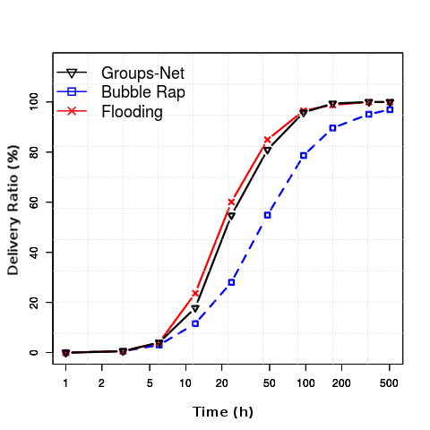
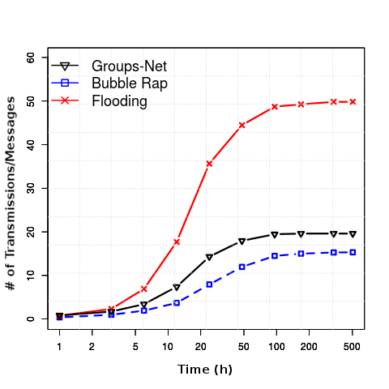
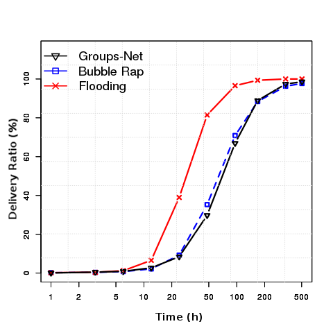
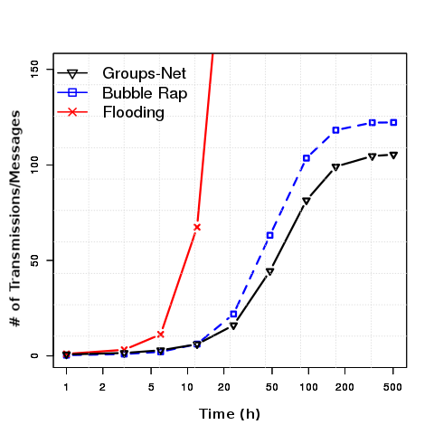

# GRM
Group Regularity Mobility Model

Research Paper: https://arxiv.org/pdf/1706.07908.pdf

GRM is a novel mobility model that accounts for the role of group meeting dynamics and regularity in human mobility. Previous mobility models do not capture the regularity of human group meetings, an important aspect that should be included by synthetic  mobility modeling since it is present in real mobility traces. Based on the characterization of statistical properties of group meetings in real mobility traces we have designed GRM. GRM maintains the typical pairwise contact properties of other synthetic models in the literature, such as contact duration and inter-contact time distributions. In addition, GRM accounts for the role of group mobility, presenting group meetings regularity and social communities structure. Mobility traces generated by GRM are fully compliant and ready to run on The ONE Simulator for opportunistic networks (https://akeranen.github.io/the-one/).

# READY TO GO MOBILITY TRACES
If you want to skip the trouble of setting up and running the code yourself to generate your own mobility traces, ready-to-go GRM mobility traces containing 100, 1000, and 2000 mobile nodes trajectories, throughout a period of 2 months, are available together with a demo video of GRM working on top of The ONE Simulator at:

https://www.dropbox.com/sh/792mi849nf3dvam/AAAR4RofaLBfoFaxmeONe-H4a?dl=0

# Opportunistic Routing on GRM Traces

One of the most common use cases of social mobility models in on the evaluation of opportinistic networks (OppNets) protocols.
OppNet protocols usually have the goal of  providing cost-effective message delivery, i.e., the highest
possible delivery ratio with the lowest possible network overhead. These metrics can be more formally defined as:

- Delivery ratio: Evaluates the percentage of successfully
delivered messages for different values of message Time
To Live (TTL).

- Number of transmissions: Measures the network overhead,
i.e., the number of device-to-device transmissions
that each algorithm performs for different TTLs.


We have evaluated the behavior of, two well know socially aware protocols for OppNets on GRM, namely Bubble Rap and GROUPS-NET.

The Bubble Rap algorithm identifies social communities
by looking at densely interconnected nodes in the aggregated
contact graph of the trace. Each node in the network must
belong to at least one community. Nodes that do not belong
to any community are assigned to a pseudo-community
of one node. This is necessary for the forwarding algorithm
operation. Also, each node gets a measure of its global popularity
in the network (GlobalRank) and a local measurement
of popularity, which is valid within that node’s community
(LocalRank). Using these parameters, the forwarding strategy
works as follows. At each encounter, a given node transmits
its content if the encountered node has a higher GlobalRank,
or if the encountered node belongs to a community of
which the final destination is a member. Once the message
is inside the final destination’s community, the forwarding
process occurs if the LocalRank of the encountered node is
higher than the LocalRank of the node that has the message.
This procedure goes on until the message reaches the
destination.

The Groups-Net algorithm works by forwarding messages
from the origin node to the destination node through the
most probable group-to-group path. To define the most
probable group-to-group path, the algorithm considers the
probability of groups of nodes re-meeting in the near future
and the probability of a message being carried between two
different groups by a person who is a member of both groups.
The probability for a group to meet again in the future is
defined based on the assumption that groups that have met
more times in the recent past have a greater chance of meeting
again in the near future. Since Groups-Net is a group
regularity based forwarding policy, it makes perfect sense to
evaluate it in GRM.

- Results on GRM generated trace with 100 nodes:

 

- Results on GRM generated trace with 1000 nodes:

 


The traces used on these experiments are available at: https://www.dropbox.com/sh/792mi849nf3dvam/AAAR4RofaLBfoFaxmeONe-H4a?dl=0


# DEPENDENCIES
- Python 2.7, 3.3 or later.
- NetworkX 1.11 or later.
- Numpy 1.8.2 or later.
- Matplotlib 1.3.1 or later.

# RUNNING
The RegDistro.csv file specifies the number of groups (column 1) and their respective meeting regularity (column 2). Other simulation parameters can be configured inside main.py source. Please refer to GRM paper for details on the simulation parameters.

- Option 1: "python main.py" -- uses synthetic social graph
- Option 2: "python main.py path_to_social_net_spec_file" -- uses any specified social graph

OUTPUT TRACES:

- sorted_trace.csv : nodes mobility sorted by time (compatible with The ONE Simulator)
- trace.csv : nodes mobility sorted by node ID
- contacts_test.csv : pairwise proximity contacts due to social group meetings. Coincidental contacts, due to intersections of individual trajectories are not listed in this file.
Format: "ID1 ID2 CONTACT-TIME CONTACT-DURATION"

# Citation Information (bibtex): 
```latex
@INPROCEEDINGS{
    grm,
    AUTHOR="Ivan O. Nunes and Clayson Celes and Michael Silva and Pedro {Vaz de Melo} and Antonio {A.F. Loureiro}",
    TITLE="{GRM:} Group Regularity Mobility Model",
    BOOKTITLE="20th ACM International Conference on Modeling, Analysis and Simulation of Wireless and Mobile Systems (MSWiM'17)",
    ADDRESS="Miami Beach, USA",
    YEAR=2017
}
```

